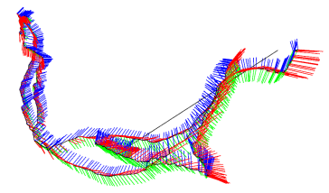

# slam14-learning-process
## 用途
记录yj的slam14讲学习过程，工程尽量避免代码的直接复制粘贴

## 目录
### ch03-三维空间的刚体运动
### ch04-李群与李代数（待完成）
### ch05-相机与图像
### ch06-非线性优化（待完成）
### ch07-视觉里程计1
### ch08-视觉里程计2
### ch09-后端1
### ch10-后端2
## 环境
Ubuntu20.04